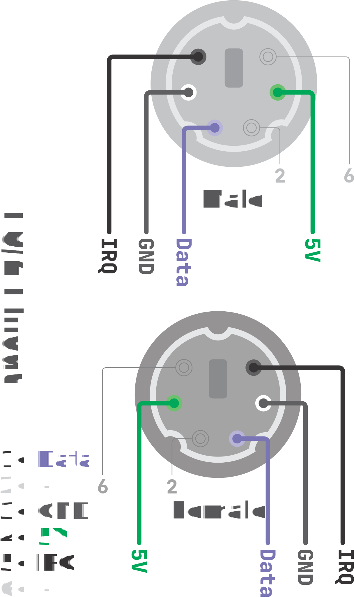
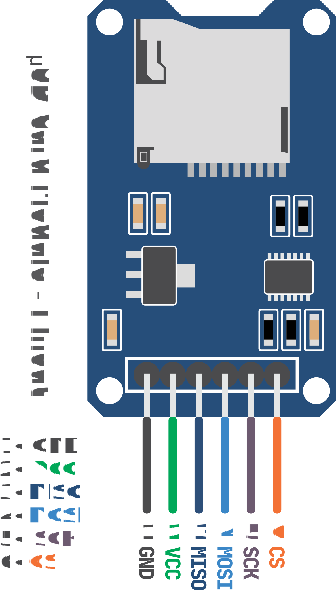
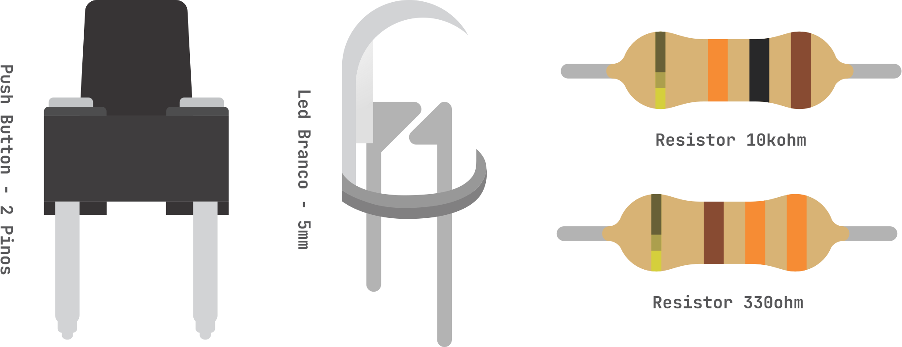
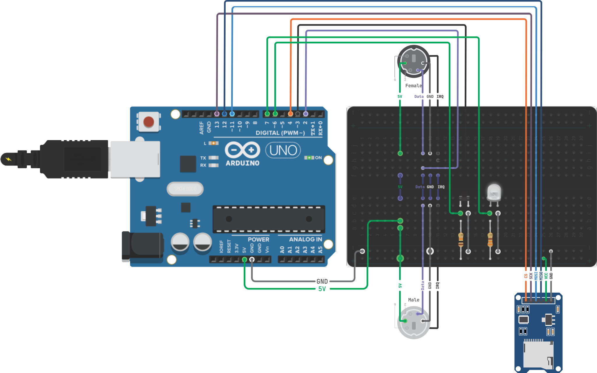

<h1 align="center" > <b> Hardware keylogger </b> - 
 Projeto de prova de conceito</h1>

<h1 align="center">

</h1>

  

Para a realização desse projeto prático de hardware keylogger foi utilizados os seguintes recurso:

| Quantidade |        Produto         |
| :--------: | :--------------------: |
|     01     |       PS/2-Fêmea       |
|     01     |      PS/2- Macho       |
|     01     |       Protoboard       |
|     26     |        Jumpers         |
|     01     |       Led branco       |
|     01     |   Resistor > 330 Ohm   |
|     01     |     Resistor > 10K     |
|     01     | Chave Táctil > 2 Pinos |
|     01     |  MicroSD Card Adapter  |
|     01     |   Cartão de memória    |
|     01     |      Arduino Uno       |

<h1 align="left">PS/2 - Pinout</h1>

<table>
  <tr>
    <td><b align="center">Pinout PS/2</b></td>
    <td><b align="center">Arduino Pin</b> </td>
  </tr>
  <tr>
    <td align="center">IRQ</td>
    <td>Pin - 3</td>
  </tr>
  <tr>
    <td align="center">Data</td>
    <td>Pin - 2</td>
  </tr>
</table>
<h1 align="left">µSD Card Adapter - Pinout</h1>

<table>
  <tr>
    <td><b align="center">Pinout µSD Adapter</b></td>
    <td><b align="center">Arduino Pin</b> </td>
  </tr>
  <tr>
    <td align="center">MOSI</td>
    <td>Pin - 11</td>
  </tr>
  <tr>
    <td align="center">MISO</td>
    <td>Pin - 12</td>
  </tr>
  <tr>
    <td align="center">CLK</td>
    <td>Pin - 13</td>
  </tr>
  <tr>
    <td align="center">CS</td>
    <td>Pin - 4</td>
  </tr>
</table>
<h1 align="left"> Push Button e Led</h1>

<table>
  <tr>
    <td><b align="center">Pinout</b></td>
    <td><b align="center">Arduino Pin</b></td>
    <td ><b align="center">Resistor</b></td>
  </tr>
  <tr>
    <td >Button</td>
    <td align="center">Pin - 6</td>
    <td>10K Ohm (Ω)</td>
  </tr>
  <tr>
    <td >Led</td>
    <td align="center">Pin - 7</td>
    <td>330 Ohm (Ω)</td>
  </tr>
</table>

<h1 align="left">Montagem<h1>

  

  

### Funcionamento

- > Alimentação de todo circuito será provida pelo cabo PS/2 Macho.

- > Conexão entre os cabos PS/2 Macho e Femea devem ser direta.

- > Interceptação de <code>Data (Dados)</code> e <code> IRQ (Clock)</code> transmitidos a partir do cabo PS/2 Fêmea é feita antes da retransmissão.

- > O led deve acender quando o teclado estiver acessível (alguma tecla for digitada).

- > O Botão dispara a função que carregar no Serial monitor o registro de teclas pressionadas no teclado.

- > Todos os registros serão gravados em um cartão de memória usando o Módulo de cartão SD

#
